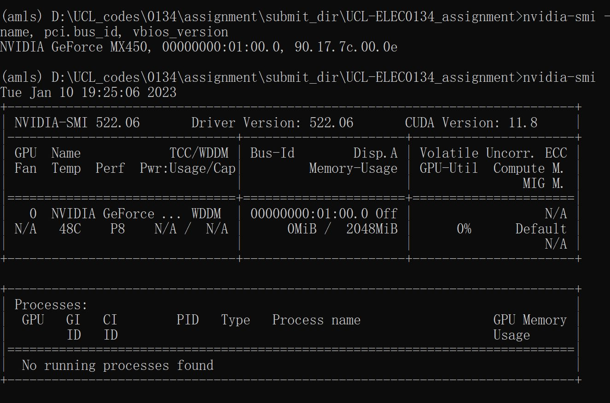

# UCL-ELEC0134_assignment
UCL ELEC0134 course final assignment by Heng Jin 22212102

This readme is to illustrate the structure of the codes and precedures to train-test the model.

### Resnet, a deep convolutional neural network is used in all tasks.  

To achieve fast development of codes, I used pytorch library as the Deep learning framework.
Moreover, I used Nvidia GPU to accelerate the runtime. 

Under the environment of NVIDIA GeForce MX450  (lightweight gpu integrated in laptop), 
Nvidia Driver Version: 522.06, CUDA Version 11.8, 
it takes roughly 70 secs per epoch (5000 images).

### Python libraries used
- pytorch
- numpy
- matplotlib
- pillow
- csv
- pathlib
- logging

All these are frequently used libraries, you can install them manually.
Or run the command : pip install -r requirements.txt to on python 
virtual environment to configure relevant libraries.

For pytorch, I installed it by command: 
"conda install pytorch torchvision torchaudio pytorch-cuda=11.7 -c pytorch -c nvidia" in Win10. 
Please check official website to install it correctly.
<https://pytorch.org/get-started/locally/>

Since the corresponding pytorch version for CUDA 11.8 haven't been published. 
I tried the 11.7 version, fortunately it works for me.

After running, 

### Program structure
-- AMLS_22-23_SN22212102 

&emsp; -- A1

&emsp;&emsp; -- A1.py

&emsp; -- A2

&emsp;&emsp;  A2.py

&emsp; -- B1

&emsp;&emsp; -- B1.py

&emsp; -- B2

&emsp;&emsp; -- B2.py

&emsp; -- main.py

### Program run instruction
You can "python A1/A2/B1/B2.py" to run each task alone. 
Or you can use "python main.py", 4 tasks will be run one by one.

For each task.py running, 
training will be done in 5 epochs and test will be done after each epoch.

If using multi-GPU server, 
please add "CUDA_VISIBLE_DEVICES=0' at the front of commend to avoid some errors (using only 1 GPU).

The default batchsize is 16, which can be support by 2GB GPU memory. 
If using bigger GPU, larger batchsize can be used to accelerate runtime and enhance performance. The Batchsize variable can be changed inside A1/A2/B1/B2.py.